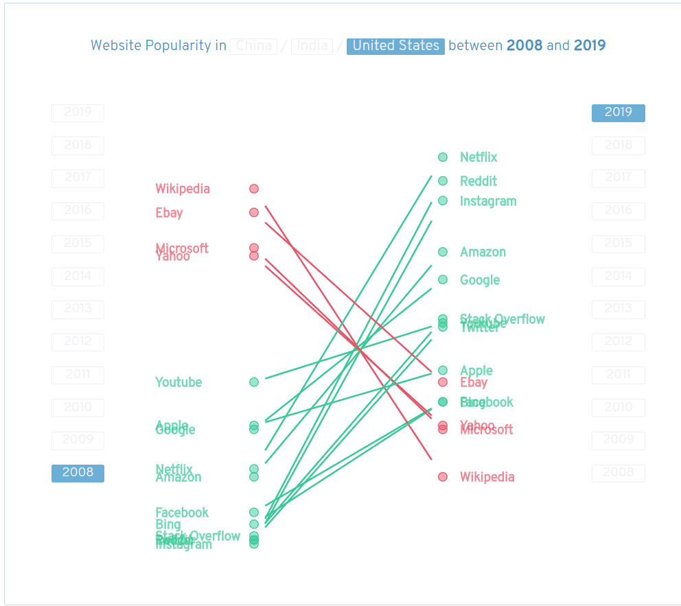
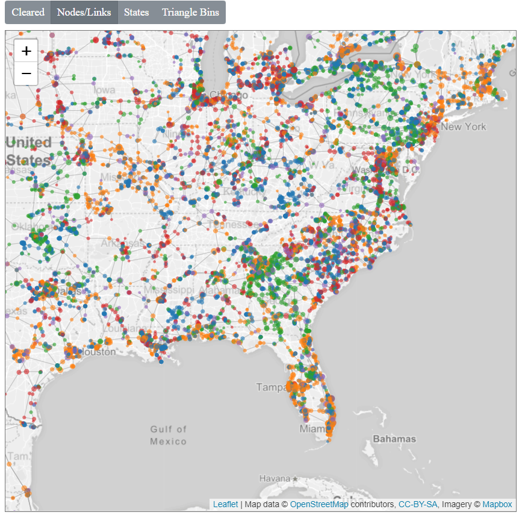
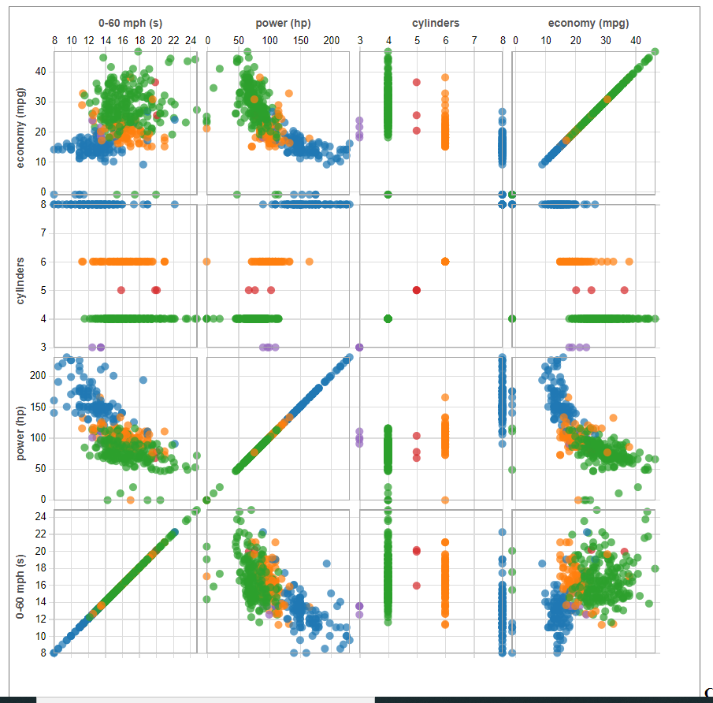
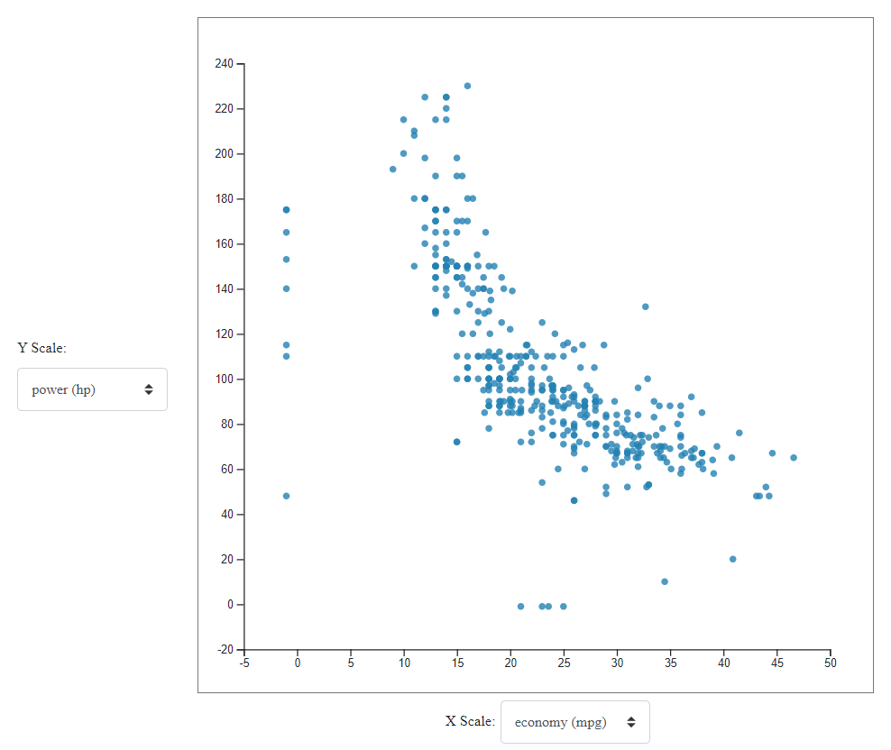
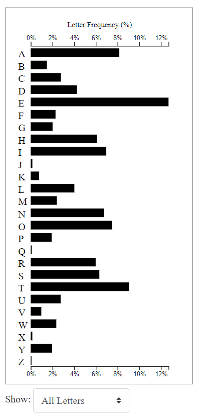
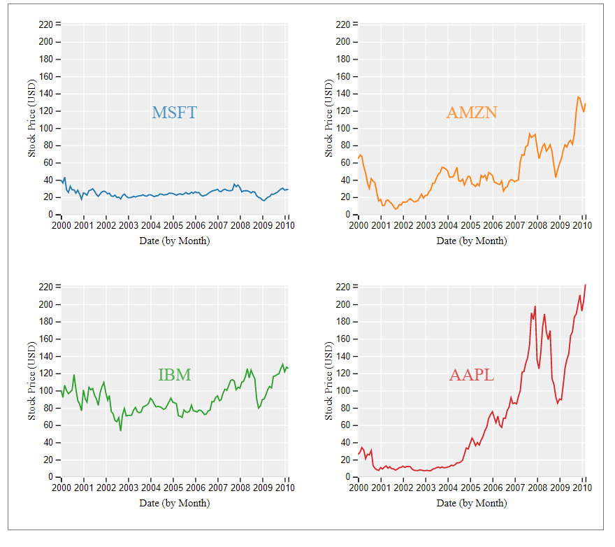
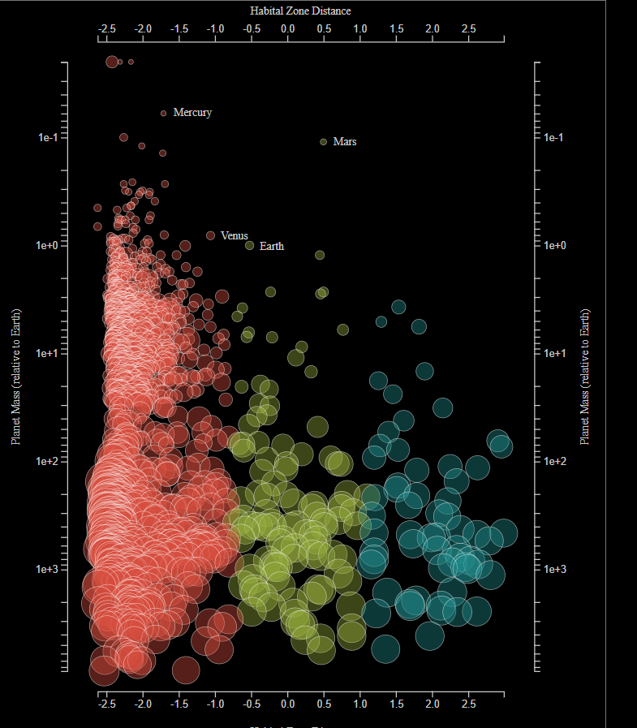
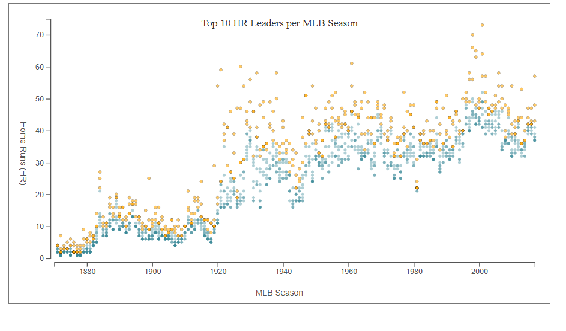
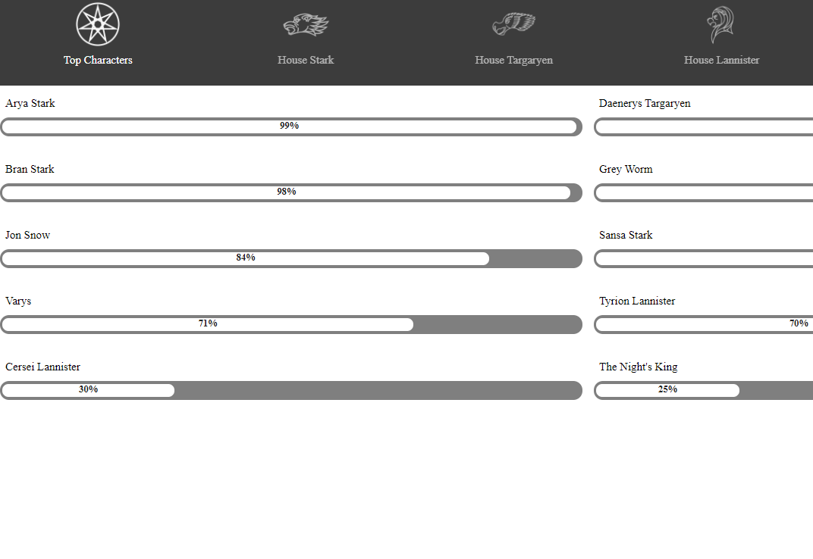

## Projects

These projects were developed during my MSCS degree at _Georgia Institute of Technology_ for my specialization in Visual Data Analytics.

[Game of Thrones Character Directory](https://artur-cabral.github.io/D3Portfolio/Lab1/index.html) 
[Interactive MLB Scatterplot](https://artur-cabral.github.io/D3Portfolio/Lab2/index.html) 
[Exoplanets Bubble Scatterplot](https://artur-cabral.github.io/D3Portfolio/Lab3/index.html) 
[Stock Price Time-Series Trellis](https://artur-cabral.github.io/D3Portfolio/Lab4/index.html) 
[Letter Frequency Horizontal Bar Chart](https://artur-cabral.github.io/D3Portfolio/Lab5/index.html) 
[Car Info Interactive Scatterplot](https://artur-cabral.github.io/D3Portfolio/Lab6/index.html) 
[Car Info Trellis Interactive Scatterplot](https://artur-cabral.github.io/D3Portfolio/Lab7/index.html) 
[Geoviz Area Density](https://artur-cabral.github.io/D3Portfolio/Lab8b/index.html) 
[Website Popularity Linked Graph](https://artur-cabral.github.io/D3Portfolio/HW4/index.html)  

| | | |
|:-------------------------:|:-------------------------:|:-------------------------:|
| [Website Popularity Linked Graph](https://artur-cabral.github.io/D3Portfolio/HW4/index.html)  |  [Geoviz Area Density](https://artur-cabral.github.io/D3Portfolio/Lab8b/index.html) | [Car Info Trellis Interactive Scatterplot](https://artur-cabral.github.io/D3Portfolio/Lab7/index.html) |
| [Car Info Interactive Scatterplot](https://artur-cabral.github.io/D3Portfolio/Lab6/index.html) |   [Letter Frequency Horizontal Bar Chart](https://artur-cabral.github.io/D3Portfolio/Lab5/index.html) | [Stock Price Time-Series Trellis](https://artur-cabral.github.io/D3Portfolio/Lab4/index.html) |
| [Exoplanets Bubble Scatterplot](https://artur-cabral.github.io/D3Portfolio/Lab3/index.html) |   [Interactive MLB Scatterplot](https://artur-cabral.github.io/D3Portfolio/Lab2/index.html) | [Game of Thrones Character Directory](https://artur-cabral.github.io/D3Portfolio/Lab1/index.html) |

### Education

_Georgia Institute of Technology_, Atlanta, GA &nbsp;&nbsp;&nbsp;&nbsp;&nbsp;&nbsp;&nbsp;&nbsp;&nbsp;&nbsp;&nbsp; January 2019 - December 2020 (Projected) 
Master of Science, Computer Science  
_Coker College_, Hartsville, SC &nbsp;&nbsp;&nbsp;&nbsp;&nbsp;&nbsp;&nbsp;&nbsp;&nbsp;&nbsp;&nbsp;&nbsp;&nbsp;&nbsp;&nbsp;&nbsp;&nbsp;&nbsp;&nbsp;&nbsp;&nbsp;&nbsp;&nbsp;&nbsp;&nbsp;&nbsp;&nbsp;&nbsp;&nbsp;&nbsp;&nbsp;&nbsp;&nbsp;&nbsp;&nbsp;&nbsp; January 2014 - May 2017 
Bachelor of Arts, Computer Science &nbsp;&nbsp;&nbsp;&nbsp;&nbsp;&nbsp;&nbsp;&nbsp;&nbsp;&nbsp;&nbsp;&nbsp;&nbsp;&nbsp;&nbsp;&nbsp;&nbsp;&nbsp;&nbsp;&nbsp;&nbsp;&nbsp;&nbsp;&nbsp; GPA: 3.94  

### Contact

**Artur Bessa Cabral** 
MS Computer Science  
_Georgia Institute of Technology_ | College of Computing  
[artur-cabral@gatech.edu](mailto:artur-cabral@gatech.edu) | [LinkedIn](https://www.linkedin.com/in/artur-cabral/) 

